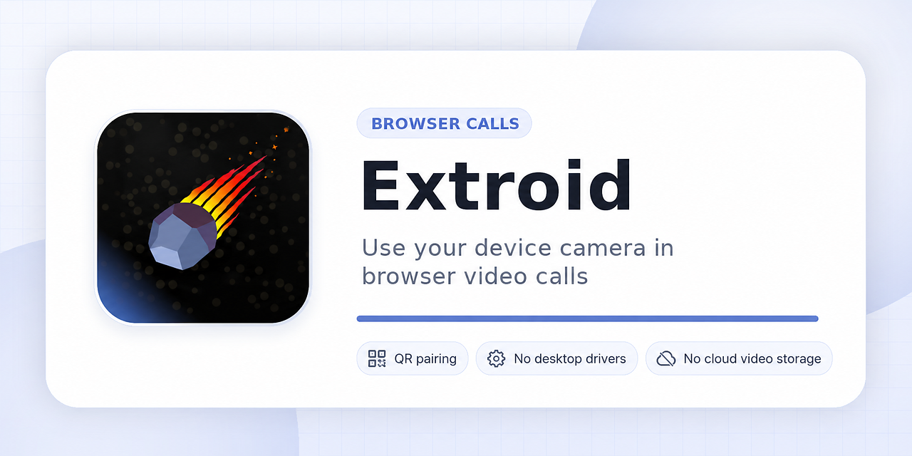

# Extroid – Phone Webcam for Browser Calls

Extroid is a browser extension that lets Chrome and Chromium-based browsers use a connected device camera in browser-based video calls. It is designed for browser calls such as Google Meet and Zoom Web. It does not create a system-wide webcam for native desktop apps.

## Official links

- [Extroid website](https://extroid.alittle.pro/)
- [Chrome Web Store listing](https://chromewebstore.google.com/detail/kefmmlpligadeljhhpbhlgfoaomnaplb)
- [Extroid compatibility guide](https://extroid.alittle.pro/compatibility)
- [Camera Check](https://extroid.alittle.pro/camera-check)
- [Use your phone camera in Google Meet](https://extroid.alittle.pro/phone-camera-google-meet)
- [Privacy policy](https://extroid.alittle.pro/privacy)

## Articles

- [How to build a browser-based virtual webcam with WebRTC](https://extroid.alittle.pro/blog/virtual-webcam)
- [Zero-JavaScript landing pages with React Router prerendering](https://extroid.alittle.pro/blog/zero-javascript)

## What Extroid is

- Extroid connects a device camera to supported browser-based video calls.
- The current focus is camera usage in Chrome and Chromium-based browsers.
- Future Extroid features may include additional device-to-browser tools.

## What Extroid is not

- Extroid does not create a system-wide webcam.
- It is not intended for OBS, Zoom Desktop, Teams Desktop, or other native desktop apps.

## Support

For compatibility notes, see the [Extroid compatibility guide](https://extroid.alittle.pro/compatibility).

For camera testing, open [Camera Check](https://extroid.alittle.pro/camera-check).
